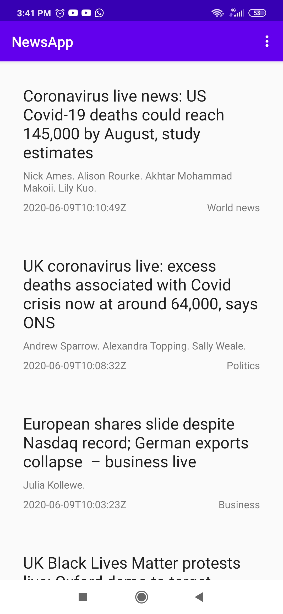
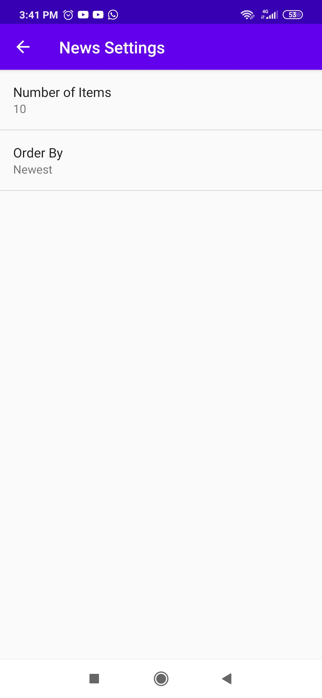
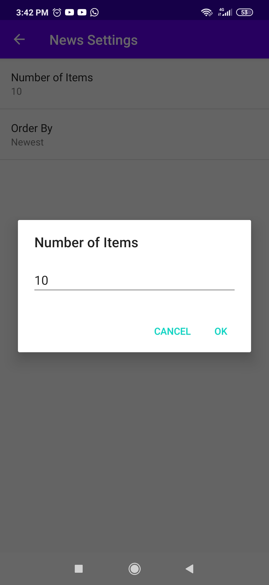
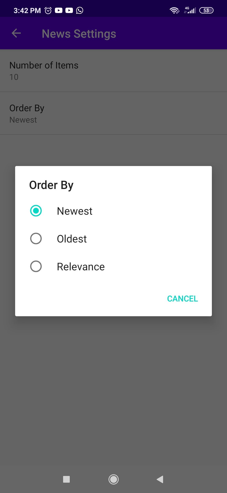

# News-App

Capstone Project of Android Basics Nanodegree at Udacity
### Project Overview
The goal is to create a News Feed app which gives a user regularly-updated news from the internet.The user can specify manually
the number of news items they want(by default 10). The user can also sort the news by newest, oldest, or by relevance.
This Project uses [Guardian API](https://open-platform.theguardian.com/documentation/). This is a well-maintained API which
returns information in a JSON format.
### API Key Note
You need to insert your API key. Go to the file MainActivity.java and find the String API_KEY. Replace "test" with your own "API_KEY"
```java
public static final String API_KEY = "YOUR-API-KEY";
```
### Features
- Guardian API
- JSON Parsing
- SharedPreferences
- Loaders
- Intent
- ListView
- Fragment
- HttpURLConnection
- Uri
### Screenshots
     
     
